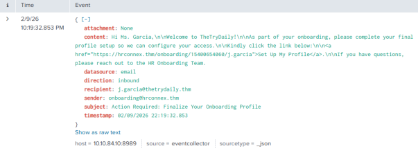
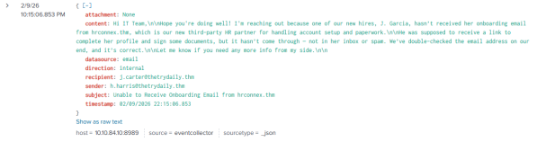
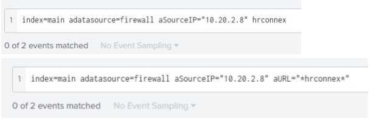

# SOC Incident Report – Inbound Email Containing External Link

**Analyst:** Huldreich M.  
**Incident ID:** 8818  
**Alert Title:** Inbound Email Containing External Link  
**Severity (Original):** Medium  
**Date of Investigation:** 09/02/2026  
**Status:** Closed – Informational / False Positive  

---

## 1. Executive Summary
On 09/02/2026, an alert was triggered due to an inbound email containing an external hyperlink addressed to **j.garcia@thetrydaily.thm**.  

Investigation focused on determining whether the embedded link was accessed and whether the email represented a phishing attempt or legitimate business communication.  

After log correlation and contextual validation, **no evidence of user interaction or malicious activity** was identified. The alert was classified as **Informational / False Positive**.

---

## 2. Alert Details
- **Datasource:** Email  
- **Direction:** Inbound  
- **Sender:** onboarding@hrconnex.thm  
- **Recipient:** j.garcia@thetrydaily.thm  
- **Subject:** Action Required: Finalize Your Onboarding Profile  
- **Link:** [https://hrconnex.thm/onboarding/15400654060/j.garcia](https://hrconnex.thm/onboarding/15400654060/j.garcia)  
- **Attachment:** None  

> The alert was generated due to the presence of an external link with potentially suspicious characteristics.

### 2.1 SIEM Alert Details Screenshot
  
*Screenshot capturing the SIEM alert for the inbound email event.*

### 2.2 Email Authentication & Domain Validation
| Check | Result |
|-------|--------|
| SPF | Pass |
| DKIM | Pass |
| DMARC | Aligned |
| Sender Domain | hrconnex.thm |

- Domain structure consistent with internal third-party naming convention  
- No spoofing indicators identified in email headers  
- Email passed authentication checks with no evidence of domain impersonation or header manipulation

---

## 3. Investigation Process

### 3.1 Email Log Correlation
- Multiple inbound emails from **onboarding@hrconnex.thm** identified within short timeframe  
- Internal email from **h.harris@thetrydaily.thm** referenced onboarding communication  
- Provided business context validating legitimacy of domain  

  
*Internal email confirming HR onboarding process.*

### 3.1.1 Business Context Validation
- Domain cross-referenced with known trusted vendors and internal documentation  
- Findings:
  - Domain referenced in internal onboarding communication  
  - Consistent branding and naming convention  
  - No typosquatting characteristics identified  
  - Communication aligned with ongoing HR onboarding workflow  

> Contextual validation reduces phishing likelihood.

### 3.2 Endpoint & Firewall Log Analysis
- **Recipient Endpoint:**  
  - Hostname: win-3452  
  - Source IP: 10.20.2.8  

- Firewall logs queried for outbound connections to hrconnex.thm:  
index=main 10.20.2.8
index=main hrconnex

- **Result:** No outbound connection attempts identified  
- No evidence of user interaction observed  

  
*Firewall log search confirming absence of outbound connection from recipient endpoint.*

### 3.3 Threat Intelligence & Reputation Check
- Domain **hrconnex.thm** reviewed:  
- Not in threat intelligence blacklists  
- No prior malicious classification in SIEM  
- No abnormal DNS resolution patterns  
- No associated malicious infrastructure  

> Supports legitimacy of the domain.

---

## 4. Findings
- Domain **hrconnex.thm** is a legitimate third-party HR onboarding platform  
- Internal communication confirms expected onboarding process  
- No malicious attachments present  
- No outbound traffic to embedded URL recorded  
- **No Indicators of Compromise (IOCs)** identified  

### 4.1 MITRE ATT&CK Considerations
- Evaluated under potential phishing-related techniques:  
- **T1566 – Phishing**  
- **T1204 – User Execution**  
- No behavioral indicators consistent with these techniques detected  

---

## 5. Risk Assessment
- Likelihood of compromise: Low  
- Impact potential: Low  
- Overall Risk Level: Low  
- No evidence supports escalation or further containment actions  

### 5.1 Investigative Reasoning
Factors supporting classification as **Informational / False Positive**:  
- Email authentication passed (SPF, DKIM, DMARC)  
- Domain validated via internal business communication  
- No user interaction recorded  
- No outbound connections to embedded link  
- No suspicious endpoint activity  

> Absence of technical and behavioral indicators confirms no security threat.

### 5.2 Detection Tuning Recommendation
- Whitelist validated third-party onboarding domains  
- Implement contextual alert enrichment (vendor tagging)  
- Adjust alert logic to prioritize external links failing authentication  
- Correlate email alerts with user click telemetry before elevating severity  

> Reduces false positives and improves analyst efficiency.

---

## 6. Conclusion
- Alert triggered by presence of external link in inbound email  
- Investigation confirms legitimate onboarding correspondence from trusted third-party HR partner  
- **No user interaction or malicious activity detected**  

**Final Classification:** Informational / False Positive  
**Escalation Required:** No  
**Further Action:** None

---

## 7. Evidence Summary
- **SIEM alert details** (Email event log)  
- **Internal business context validation email**  
- **Firewall search results** confirming no outbound connection  

> All evidence supports conclusion of legitimate business activity.

---
