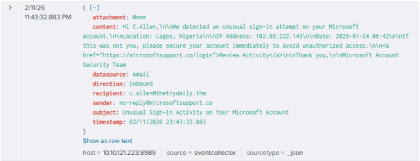
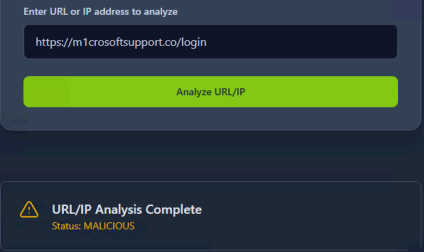
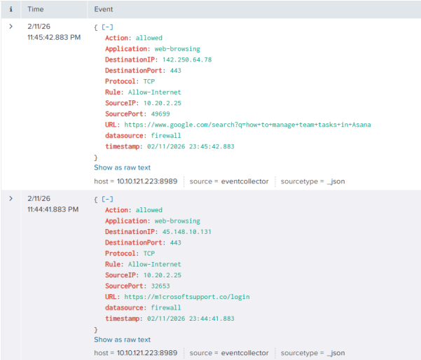

# Inbound Phishing Email – User Click Investigation

**Incident ID:** 8817  
**Severity (Original):** Medium  
**Analyst:** Huldreich M.  
**Date of Investigation:** 02/11/2026  
**Status:** Closed – True Positive (User Clicked)

---

## Executive Summary

On February 11, 2026, a security alert was triggered due to an inbound email containing a suspicious external hyperlink sent to c.allen@thetrydaily.thm.

The objective of the investigation was to determine:

- Whether the email was malicious
- Whether the user interacted with the embedded link
- Whether any post-click malicious activity occurred

Analysis confirmed that the email originated from a typosquatting domain (`m1crosoftsupport.co`) impersonating Microsoft. Firewall logs confirmed that the user clicked the link; however, no additional malicious activity, credential harvesting, or malware execution was observed.

The incident was classified as:

**True Positive – User Clicked Phishing Link (No Further Compromise)**

---

## Alert Details

- **Datasource:** Email Security Gateway  
- **Direction:** Inbound  
- **Sender:** no-reply@m1crosoftsupport.co  
- **Recipient:** c.allen@thetrydaily.thm  
- **Subject:** Unusual Sign-In Activity on Your Microsoft Account  
- **Embedded Link:** https://m1crosoftsupport.co/login  
- **Attachment:** None  

The alert was triggered due to a suspicious external link impersonating Microsoft infrastructure.

### Evidence – SIEM Log

---

## Email Header & Authentication Analysis

Authentication review revealed:

- SPF: Softfail (domain mismatch observed)
- DKIM: Not aligned with legitimate Microsoft domain
- DMARC: Failed policy alignment
- Return-Path Domain: m1crosoftsupport.co
- Sender Display Name: Microsoft Security Team

Header inconsistencies confirmed domain spoofing and phishing intent.

Domain analysis indicated:

- Recently registered domain
- Typosquatting pattern (character substitution: “1” instead of “i”)
- Infrastructure not associated with legitimate Microsoft services

These indicators strongly support malicious classification.

---

## Investigation Process

### 1. Email & URL Analysis

Phishing indicators identified:

- Typosquatting domain (`m1crosoftsupport.co`)
- Urgency-based language
- Fake login location alert (Lagos, Nigeria)
- Credential harvesting theme
- No attachments present

The embedded URL was scanned using TryDetect, which flagged it as malicious.

This confirms deliberate impersonation and phishing intent.

---

### 2. Firewall Log Analysis

Firewall logs were reviewed to determine whether user interaction occurred.

**User Endpoint Details:**
- Source IP: 10.20.2.25

**Findings:**

1. User accessed `https://m1crosoftsupport.co/login` at 23:44:41
2. Outbound connection allowed over TCP 443
3. Subsequent activity showed normal browsing behavior
4. No additional outbound connections observed
5. No file downloads detected

Splunk Query Used:
index=* SourceIP=10.20.2.25
Time Range: Last 1 hour

Observed behavior indicates the session did not progress beyond initial page access.

---

### 3. Endpoint Impact Validation

Additional telemetry review included:

- Process creation events post-click
- Credential harvesting indicators
- Abnormal child processes spawned by browser
- DNS queries for secondary infrastructure
- Potential file download attempts
- PowerShell or script interpreter execution

Findings:

- No suspicious process execution observed
- No abnormal scripting activity detected
- No command-and-control communication identified
- No registry modifications or persistence mechanisms found

There is no evidence of endpoint compromise following user interaction.

---

## Findings

- Confirmed phishing attempt via typosquatting domain
- User clicked the malicious link
- HTTPS session established
- No Indicators of Compromise (IOCs) identified
- No lateral movement or credential abuse detected

---

## MITRE ATT&CK Mapping

The observed activity aligns with:

- T1566 – Phishing  
- T1204 – User Execution  
- T1071.001 – Application Layer Protocol: Web Protocols  
- T1583.001 – Acquire Infrastructure: Domains (Typosquatting)  

No additional post-exploitation techniques were identified.

---

## Risk Assessment

- Likelihood of compromise: Low  
- Impact potential: Low  
- Overall Risk Level: Low  

No containment or escalation required.

---

## Investigative Reasoning

Although no post-click malicious activity occurred, the case was classified as **True Positive** due to:

- Confirmed malicious infrastructure
- User interaction with phishing link
- Allowed outbound HTTPS session

However, absence of:

- Credential submission evidence
- Suspicious redirection chains
- Malware download activity
- Abnormal authentication attempts

supports the conclusion that the attack did not progress beyond initial interaction.

---

## Detection & Prevention Recommendations

To reduce risk of similar incidents:

- Enable URL sandbox detonation in email gateway
- Implement domain age-based filtering
- Enforce browser isolation for high-risk categories
- Conduct targeted phishing awareness training for the affected user
- Monitor user authentication logs for 24–48 hours post-incident

These measures enhance early-stage phishing detection and user protection.

---

## Conclusion

The alert originated from an inbound phishing email impersonating Microsoft.

Investigation confirmed:

- Malicious typosquatting domain
- User click activity
- No subsequent compromise

**Final Classification:** True Positive – User Clicked Phishing Link  
**Escalation Required:** No  
**Follow-Up Action:** User awareness communication

---

## Evidence Summary

- SIEM log confirming user click
- TryDetect URL reputation scan
- Firewall log confirming normal post-click activity

All collected evidence supports the conclusion that this was a phishing attempt with user interaction but no further compromise.
