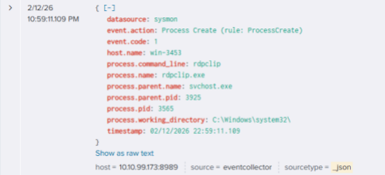

# Security Event Analysis Report

**Analyst:** Huldreich M.  
**Role:** SOC Analyst (Training Simulation)  
**Platform:** TryHackMe Simulation Environment  
**Host:** WIN-3453  
**Date Identified:** February 12, 2026  
**Time Identified:** 22:57 (UTC)  
**Case ID:** 1006  
**Alert Title:** Suspicious Parent-Child Process Relationship  
**Severity Level:** Low  
**Category:** Process Execution Monitoring  
**Detection Source:** Endpoint Telemetry (Sysmon)  
**Analysis Type:** Security Event Review  

---

## 1. Executive Summary
On February 12, 2026, a **Sysmon Event ID 1 (Process Creation)** alert was generated on host **WIN-3453** involving execution of `rdpclip.exe`.  

The alert was triggered due to a monitored parent-child process relationship. After validating binary integrity, execution context, session correlation, and surrounding telemetry, the activity was determined to be **benign**, consistent with standard Windows Remote Desktop functionality.  
No indicators of compromise were identified.

---

## 2. Event Details

**Sysmon Event:** Event ID 1 – Process Create  

### 2.1 Event Metadata
| Attribute | Value |
|-----------|-------|
| Process Name | rdpclip.exe |
| Image Path | C:\Windows\System32\rdpclip.exe |
| Process ID (PID) | 4128 |
| Parent Process | svchost.exe |
| Parent Process ID (PPID) | 980 |
| Process GUID | {A1B2C3D4-E5F6-7890-ABCD-1234567890AB} |
| User Account | WIN-3453\User01 |
| Logon Type | 10 (RemoteInteractive – RDP Session) |
| Integrity Level | Medium |
| SHA256 Hash | Matches known legitimate Windows binary |

> All captured metadata is consistent with normal RDP clipboard process initialization.

### 2.2 Event Screenshot
  
*Screenshot capturing Sysmon Event ID 1 details, including process creation metadata and execution context.*

---

## 3. Analytical Approach
Investigation followed a structured SOC methodology:  
- Binary legitimacy validation  
- File path verification  
- Digital signature validation  
- Parent-child process relationship analysis  
- Command-line inspection  
- User session correlation  
- Behavioral telemetry review  
- MITRE ATT&CK contextual evaluation  

> This layered approach ensures both technical validation and adversarial abuse consideration.

---

## 4. Process Legitimacy Assessment

### 4.1 Binary Validation
- `rdpclip.exe` is a legitimate Windows system process responsible for clipboard redirection in RDP sessions.  
- Executed from correct system directory: `C:\Windows\System32\rdpclip.exe`  
- Digital signature verified: Signed by Microsoft Windows Publisher  
- SHA256 hash matches expected Windows build  
- **No evidence** of tampering, masquerading, or side-loading  

### 4.2 Parent Process Analysis
- Parent process: `svchost.exe`  
- Relationship consistent with standard Windows service management  
- No suspicious intermediary process identified  

### 4.3 Command-Line Review
- Command line: `rdpclip`  
- No suspicious parameters, encoded payloads, execution policy bypass, remote download indicators, or abnormal switches  

### 4.4 User Context & Session Validation
- Executed under **Logon Type 10 (RemoteInteractive)** – active RDP session  
- User account: Standard, no elevated privileges  
- No anomalous authentication or privilege escalation events detected  
- Execution context aligns with legitimate RDP clipboard functionality  

---

## 5. Behavioral Correlation
- Reviewed telemetry for:  
  - Outbound connections  
  - File creation/modification  
  - Registry changes  
  - Suspicious child processes  
  - Credential access indicators  

**Findings:**  
- No anomalous or malicious follow-up activity  
- No beaconing, lateral movement, or privilege escalation  
- Behavior consistent with normal RDP session activity  

---

## 6. Risk Assessment
- **Risk Level:** Informational / Benign Activity  
- No evidence of compromise, lateral movement, persistence, or C2 activity  

### 6.1 Investigative Reasoning
Potential abuse patterns evaluated:  
- Execution from non-standard directories  
- Masquerading with similar binary names  
- Suspicious parent processes (e.g., winword.exe, powershell.exe)  
- Execution without active RDP session  
- Association with credential theft  

> All patterns ruled out based on verified path, valid digital signature, legitimate parent, active session, and normal telemetry.

### 6.2 MITRE ATT&CK Considerations
- **T1021.001 – Remote Services: Remote Desktop Protocol**  
- **T1059 – Command and Scripting Interpreter**  

> Execution did not align with adversarial behavior for these techniques.

### 6.3 Detection Engineering Recommendation
- Trigger alerts if `rdpclip.exe` executes outside `C:\Windows\System32`  
- Alert if spawned by non-standard parent processes  
- Correlate execution with absence of active RDP session  
- Flag failed digital signature validation  

> These improvements reduce false positives and increase SOC efficiency.

---

## 7. Conclusion
- Sysmon Event ID 1 for `rdpclip.exe` on host **WIN-3453** is **benign**  
- Binary executed from expected directory, signed, parent process legitimate  
- No suspicious command-line arguments or follow-on activity detected  

**Case Status:** Benign / False Positive  
**Action Required:** None

---
